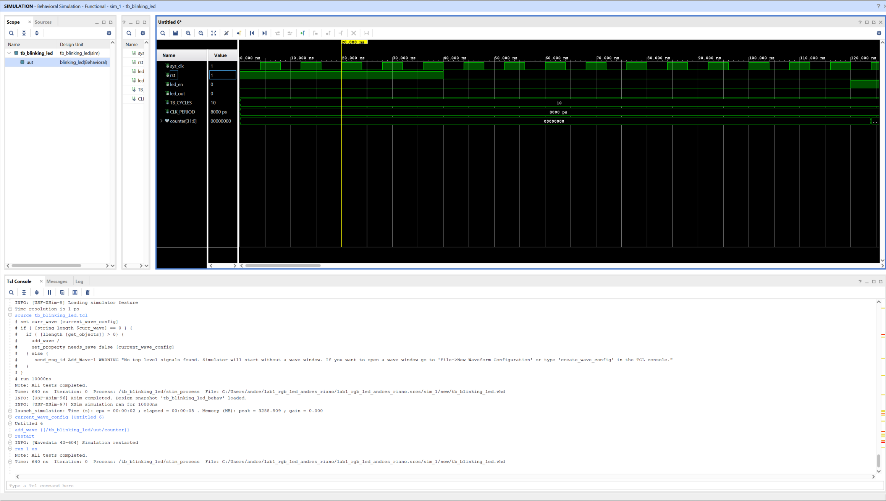
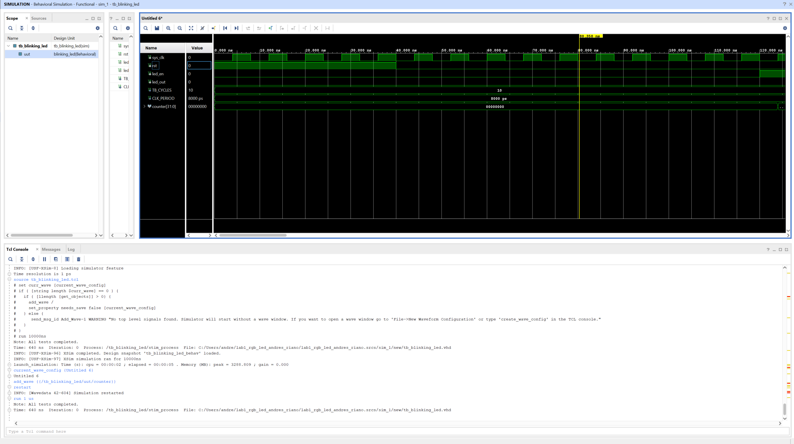
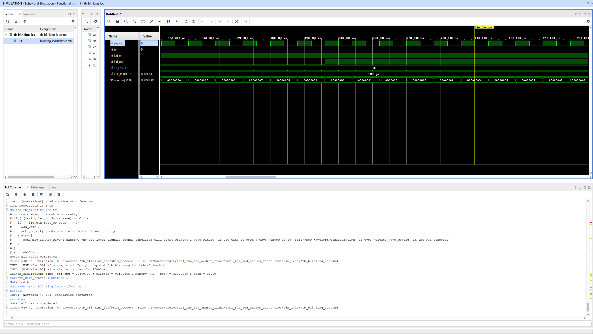
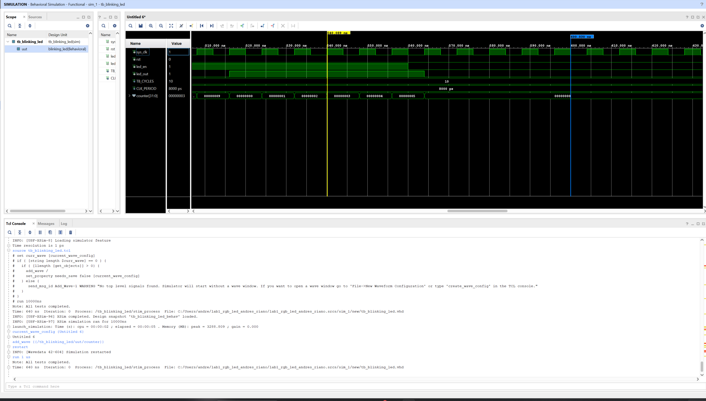

# ECE 520/L Lab 1: LED Blinker

**Andres Riano**
Zybo Z7-10, AMD Vivado 2023.2, VHDL

---

## Overview

This lab builds an LED blinker on the Zybo Z7-10. The blinker is a clock divider. It counts cycles
of the 125 MHz system clock and toggles an output when the count runs out. The count limit is a
generic, so the same module can blink once a second on hardware or once every ten clock cycles in
simulation without changing the design.

There are two Vivado projects, one for each section of the lab. Both use the same blinking_led
module, and the file is identical in each. Only the constraints differ.

| Project | Section | What it does on the board |
|---|---|---|
| blinking_led | Procedure | SW0 up makes LED0 blink once per second |
| lab1_rgb_led_andres_riano | Tasks | SW2 to SW0 select a colour on RGB LED 6 |

| File | Role |
|---|---|
| blinking_led.vhd | The clock divider |
| rgb_led_top.vhd | Tasks top level, one blinker plus a colour multiplexer |
| zybo_z7.xdc | Pin constraints, one per project |
| tb_blinking_led.vhd | Testbench for the blinker, the three required test cases |
| tb_rgb_led_top.vhd | Testbench for the Tasks top level, seven test cases |

---

## Design Summary

The clock is 125 MHz, which the constraints file sets with an 8.00 ns period. That means
125,000,000 ticks go by every second. The value I needed was half of that, because one blink is two
toggles, an on and an off. So each toggle gets half a second of ticks, which is 62,500,000. That is
the default value of the CLK_CYCLES_PER_TOGGLE generic. The counter compares against
CLK_CYCLES_PER_TOGGLE minus 1 because it starts at zero, so counting 0 through 62,499,999 is
already 62,500,000 ticks.

The blinking_led module has four ports and one generic.

| Signal | Width | Direction | Description |
|---|---|---|---|
| sys_clk | 1 | in | System clock, 125 MHz |
| rst | 1 | in | Active-high synchronous reset |
| led_en | 1 | in | LED enable |
| led_out | 1 | out | Toggles every CLK_CYCLES_PER_TOGGLE cycles |

The counter goes up by one on every rising clock edge. When it reaches the limit, led_out flips and
the counter clears. When rst is 1 or led_en is 0, both go back to 0.

The reset is synchronous because the rst check sits inside the rising_edge condition, and sys_clk is
the only signal in the sensitivity list. The circuit cannot look at rst unless a clock edge just
happened, so the reset waits its turn. Making it asynchronous would take two changes together: rst
would join the sensitivity list, and its check would move out in front of the clock check. The
difference in practice is that an asynchronous reset still works if the clock has stopped, which is
why it gets used for power-on reset. Synchronous is what this lab asked for, and the timing tools
can check it properly.

The rgb_led_top module wraps it for the Tasks section.

| Signal | Width | Direction | Description |
|---|---|---|---|
| sys_clk | 1 | in | System clock, 125 MHz |
| rst | 1 | in | Active-high synchronous reset, on BTN0 |
| sw | 3 | in | SW2 to SW0 select the colour |
| rgb_out | 3 | out | 0 is Red, 1 is Green, 2 is Blue |

| Switch | Output |
|---|---|
| SW0 | Red |
| SW1 | Green |
| SW2 | Blue |
| Any other case | RGB LED off |

I used one blinker instead of three, one per colour, for two reasons. One blinker costs 27
registers, so three would cost 81 for the same behaviour. And all three would share the same clock,
reset and count limit and would all start at zero, so they would hold the same number at every tick
and flip at the same time, forever. Two of the three outputs would just be thrown away.

The multi-switch rule is handled by assigning off as a default before the case statement.

```vhdl
process (sw, blink)
begin
    rgb_out <= "000";                    -- default: everything off
    case sw is
        when "001"  => rgb_out(0) <= blink;   -- SW0 -> Red
        when "010"  => rgb_out(1) <= blink;   -- SW1 -> Green
        when "100"  => rgb_out(2) <= blink;   -- SW2 -> Blue
        when others => null;                  -- 000, 011, 101, 110, 111 -> off
    end case;
end process;
```

The default runs every time the process wakes up, before the case is checked. So the order is
always: turn everything off, then override one bit only if exactly one switch is up. A pattern like
011 matches no valid case, null overrides nothing, and the off from the default survives.

That default is also what keeps latches out of the design. Without it, 011 would leave rgb_out with
no value, and the tool would have to build hardware that remembers the previous value, which is a
latch. The LED would not turn off. It would freeze at whatever it was when the switch was flipped.
The utilization report below shows zero latches were built.

In rgb_led_top, led_en is tied high because the colour mux already handles every case where the LED
should be off.

All pins come from Zybo-Z7-Master.xdc. Each project has its own zybo_z7.xdc.

| Port | Pin | Board resource | Project |
|---|---|---|---|
| sys_clk | K17 | 125 MHz system clock | both |
| rst | K18 | BTN0 | both |
| led_en | G15 | SW0 | blinking_led |
| led_out | M14 | LED0 | blinking_led |
| sw[0] | G15 | SW0 | Tasks |
| sw[1] | P15 | SW1 | Tasks |
| sw[2] | W13 | SW2 | Tasks |
| rgb_out[0] | V16 | LED6 Red | Tasks |
| rgb_out[1] | F17 | LED6 Green | Tasks |
| rgb_out[2] | M17 | LED6 Blue | Tasks |

RGB LED 6 is used.

---

## Verification and Results

The testbench overrides CLK_CYCLES_PER_TOGGLE to 10 using a generic map. The design file is not
changed. The smaller value is passed in from outside, which is the point of a generic.

That override is not just to make the run shorter. The testbench waits are counted in clock ticks,
80 of them, which is 640 ns, and those 80 stay 80 whatever the generic is set to. At the real value
of 62,500,000 the counter would climb to 80, never reach its limit, and never wrap, so led_out would
sit flat at 0 for the whole run. Test Case 3 asserts that led_out is 0, so on a flat line it would
pass for the wrong reason. The testbench would report that all tests completed while proving
nothing. Seeing a single toggle at the real value would mean simulating 500 million clock edges.

Each test case also has an assert, so a failure prints in the Tcl console instead of me having to
catch it in the waveform. The final run reports that all tests completed at 640 ns.

### Test Case 1, Reset Behavior

rst is 1 and led_en is 0. led_out is 0 and the counter is held at 0 throughout reset.



### Test Case 2, Disabled Output

rst is 0 but led_en is still 0. led_out and the counter stay 0, this time because the module is
turned off rather than because it is in reset. Two different reasons for the same output, which is
why they are separate test cases.



### Test Case 3, LED Toggling

led_en is 1. The counter runs 0 through 9 and led_out toggles every time it wraps, which is once
every ten rising edges of sys_clk.



Dropping led_en while led_out is high clears the output right away and holds the counter at 0, which
shows the required 1 to 0 transition.



The top-level testbench covers seven cases: reset holding the LED off with a switch up, each of the
three colours, two switches at once, no switches, and reset asserted mid-blink.

Resource utilization after implementation:

| Site Type | Used | Available | Util % |
|---|---|---|---|
| Slice LUTs | 10 | 17,600 | 0.06 |
| Slice Registers | 27 | 35,200 | 0.08 |
| Register as Flip Flop | 27 | 35,200 | 0.08 |
| Register as Latch | 0 | 35,200 | 0.00 |

Zero latches shows the default-then-override pattern worked and nothing is left without a value.

The 27 registers are worth explaining. I declared the counter as 32 bits, which asks for 32
flip-flops. It only ever reaches 62,499,999, and 26 bits already counts to 67,108,863, so bits 26
through 31 are always 0 and can never be anything else. Vivado removed them. That leaves 26 counter
bits plus one for led_state, which is exactly 27.

Timing summary after routing:

| Metric | Value |
|---|---|
| Worst Negative Slack | +3.175 ns |
| Total Negative Slack | 0.000 ns |
| Failing endpoints, setup | 0 of 53 |
| Worst Hold Slack | +0.263 ns |
| Failing endpoints, hold | 0 of 53 |

All specified timing constraints are met. The clock period is 8.00 ns and the worst path finished in
4.825 ns, so it arrived 3.175 ns early. Positive slack means there is room to spare. Negative slack
would mean the signal arrives after the clock edge that is supposed to catch it.

Both projects ran synthesis, implementation and bitstream with no errors, and both were programmed
onto the Zybo Z7-10 over JTAG.

On the Procedure project, SW0 up blinks LED0 at about 1 Hz, SW0 down holds it dark, which is led_en
going to 0 and clearing the counter and output, and holding BTN0 clears it and it starts again on
release, which is the synchronous reset working on real hardware. SW1 to SW3 do nothing, because
this project does not connect them to anything.

On the Tasks project, SW0 gives red, SW1 green and SW2 blue, all blinking at about 1 Hz. No switches
or more than one switch leaves the LED off.

---

## Known Issues or Limitations

The counter is bigger than it needs to be. I used 32 bits when 26 are enough. Synthesis removes the
extra bits so nothing is wasted in the final hardware, but sizing it would be better than relying on
the tool to clean up after me.

The switch inputs are not synchronised. They go straight from the board pins into the colour mux.
The switches are not tied to sys_clk, so if they fed a clocked process the value could get read
right as it was changing, which is called metastability, and it would need two flip-flops in a row
to clean it up. Here the path ends at an LED, so it is harmless, but it is not a pattern to copy.

Three of the seven top-level test cases have no assertions. The colour-select cases are checked by
eye in the waveform rather than by a self-checking assert. The reset and multi-switch cases are
asserted.

In rgb_led_top, led_en is tied high, so the enable is never tested there. It is shown on hardware in
the Procedure project instead, where SW0 drives it directly.

The constraints files contain only the pins each design actually uses, rather than the full Digilent
master file with the unused lines left commented out. This works the same and is easier to read, but
it is different from step 14 of the procedure.

---

## Build instructions

Open either blinking_led/blinking_led.xpr or
lab1_rgb_led_andres_riano/lab1_rgb_led_andres_riano.xpr in Vivado 2023.2, then run synthesis,
implementation and generate bitstream. Connect the board over the micro-USB PROG/UART port, then
open the Hardware Manager, Open Target, Auto Connect, and Program Device. Check the bitstream name
first, blinking_led.bit or rgb_led_top.bit.

For simulation, set tb_blinking_led as the simulation top and run a behavioural simulation. To see
the counter, select uut in the Scope panel, add counter to the wave window, then restart and run
1 us. Vivado stops at 1000 ns by default.

---

## References

1. Digilent, Zybo Z7 Reference Manual
2. Digilent, Zybo-Z7-Master.xdc, from the digilent-xdc GitHub repository
3. ECE 520/L Lab 1 handout, and Lab 0
4. AI assistance (Claude) was used for help with implementing and studying the code (debugging).
